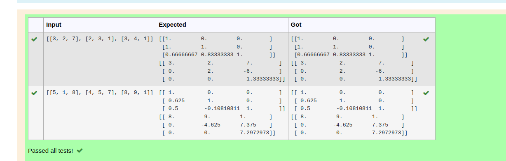
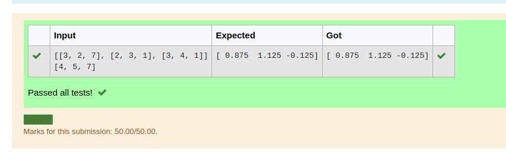

# LU Decomposition 

## AIM:
To write a program to find the LU Decomposition of a matrix.

## Equipments Required:
1. Hardware – PCs
2. Anaconda – Python 3.7 Installation / Moodle-Code Runner

## Algorithm
1. read the elements of augmented matrix into array a and b
2. calculate elements of L and U
3. print L and U matrix
4. find V by solving LV = B by forwrd substitution
5. find X by solving UX = V by backward substitution 
6. print array X as the solution

## Program:
(i) To find the L and U matrix
``` python
/*
Program to find the L and U matrix.
Developed by: SASIRAJ KUMAR TJ
RegisterNumber: 22005240
import numpy as np
from scipy.linalg import lu 

a=eval(input())
p,l,u=lu(a)
print(l)
print(u)
*/
```
(ii) To find the LU Decomposition of a matrix
```PYTHON
/*
Program to find the LU Decomposition of a matrix.
Developed by: 
RegisterNumber: 
import numpy as np
from scipy.linalg import lu_factor,lu_solve
a=eval(input())
b=eval(input())
lu, piv=lu_factor(a)
x=lu_solve((lu, piv),b)
print(x)
*/
```

## Output:



## Result:
Thus the program to find the LU Decomposition of a matrix is written and verified using python programming.

